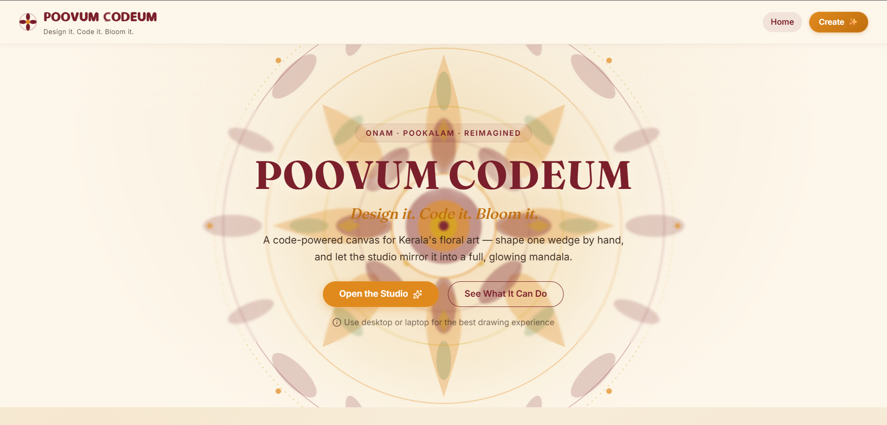

# 🌸 POOVUM CODEUM

### **Design it. Code it. Bloom it.**

**An interactive digital Pookkalam design studio inspired by the colours, patterns, and creativity of Onam.**

[🌐 **Live Demo**](https://pookkalam-2-0.vercel.app/) · [💻 **Source Code**](github.com/vishnua-dev06/pookkalam-2.0)

</div>

---

### **Design it. Code it. Bloom it.**

> An interactive digital Pookkalam design studio where users can experiment with shapes, colours, symmetry, and patterns to create their own Onam-inspired floral designs.

[](https://pookkalam-2-0.vercel.app/)
[](github.com/vishnua-dev06/pookkalam-2.0)

---

## 🌼 About the Project

### Creative Workflow

> **① Shape → ② Arrange → ③ Bloom**

- **Shape** — Choose petals, leaves, patterns, and basic elements.
- **Arrange** — Draw or drag elements into the editing sector.
- **Bloom** — Apply colour and symmetry to bring the complete Pookkalam to life.

**POOVUM CODEUM** is an interactive web-based Pookkalam creator that combines **traditional Onam art with creative digital interaction**.

Users can actively participate in the creative process by choosing shapes, arranging elements, experimenting with colours, adjusting symmetry, and watching their design evolve into a complete Pookkalam.

The project was created for the **POOVUM CODEUM – Pookkalam Designer Website Competition**, organized by **ISTE SB NSSCE – Department of Computer Science and Engineering**.

---

## ✨ Features

### 🏠 Interactive Landing Experience
- Onam-inspired visual identity
- Animated digital Pookkalam artwork
- Responsive navigation
- Direct access to the Pookkalam creator

### 🌸 Petal Studio
- Drawing mode and drag-and-drop mode
- Pen, line, circle, curve, eraser, and rotate tools
- Sector-based editing
- Undo and redo support
- Start Fresh functionality
- Compact categorized shape palette

**Shape categories:**
- 🌸 Petals
- 🌿 Leaves
- ✦ Patterns
- ◯ Basic Shapes

### 🎨 Flower Palette
- Traditional, festival, and nature-inspired colours
- Custom colour selection
- Colour fill functionality

### ✨ Bloom Symmetry
- Adjustable symmetry controls
- Quick symmetry presets
- Live visual updates
- Adjustable design size

### 🌺 Bloom Canvas
- Real-time pattern rendering
- Zoom in/out and reset
- Optional gridlines
- Fullscreen preview
- Responsive workspace layout

### 💡 Bloom Ideas
A creative inspiration feature for exploring different starting points and design moods.

### 🌸 Your Bloom
A live design summary showing:
- Shapes used
- Colours used
- Symmetry setting
- Design mood

### 🎲 Creative Tools
- Random design generation
- Interactive drawing
- Shape dragging and positioning
- Live symmetry rendering

### 📥 Save & Share
- Save the completed bloom
- Export the design layout
- Export options for the design
- Share / publish functionality

### 📱 Fully Responsive
Designed for:
- 💻 Desktop
- 📱 Mobile
- 📟 Tablet

---

## 🛠️ Tech Stack

| Technology | Usage |
|---|---|
| HTML5 | Application structure |
| CSS3 | Styling, responsiveness, animations |
| JavaScript | Interactive functionality |
| Tailwind CSS | Utility-based styling |
| Interact.js | Drag-and-drop interactions |
| Chroma.js | Colour processing |
| jsPDF | PDF export functionality |
| LZ-String | Data compression support |
| Lucide | Interface icons |
| Vercel | Deployment configuration |

---

## 📂 Project Structure

```text
pookkalam-2.0-main/
├── index.html
├── create/
│   └── index.html
├── public/
│   ├── favicon/
│   ├── fonts/
│   │   └── Dyuthi-Regular.woff2
│   ├── js/
│   │   ├── script.js
│   │   ├── download.js
│   │   ├── floodFillWorker.js
│   │   ├── publish.js
│   │   ├── random_design.js
│   │   └── tutorial.js
│   └── style/
│       ├── style.css
│       └── tutorial.css
├── sitemap.xml
├── vercel.json
├── LICENSE
└── README.md
```

---

## 🚀 Getting Started

### 1. Clone the Repository

```bash
git clone YOUR_GITHUB_REPOSITORY_URL
```

### 2. Open the Project Folder

```bash
cd pookkalam-2.0-main
```

### 3. Run a Local Server

Using Python:

```bash
python -m http.server 8000
```

Open:

```text
http://localhost:8000
```

You can also use a local server such as **VS Code Live Server**.

> Some external libraries are loaded through CDN links, so an internet connection may be required for the complete experience.

---

## 🎨 How to Create a Pookkalam

1. Open the **Create** page.
2. Choose **Drawing Mode** or **Drag & Drop Mode**.
3. Select a shape from the categorized palette.
4. Drag the shape into the editing sector.
5. Adjust the design using the drawing and editing tools.
6. Select colours from the **Flower Palette**.
7. Apply **Bloom Symmetry** to repeat the pattern.
8. Preview the result in the **Bloom Canvas**.
9. Use **Bloom Ideas** or **Random** for creative inspiration.
10. Save, export, or share your completed bloom.

---

## 🧠 Design Philosophy

> **Traditional art can become an interactive digital experience.**

POOVUM CODEUM combines the visual language of **Onam and Pookkalam traditions** with a structured digital creation workflow.

| Area | Purpose |
|---|---|
| 🌸 **Petal Studio** | Create and arrange individual elements |
| 🌺 **Bloom Canvas** | Watch the complete design evolve |
| ✨ **Design Flow** | Control symmetry, colours, inspiration, and export |

---

## 🖥️ Live Demo

### 🌸 [Visit POOVUM CODEUM](https://pookkalam-2-0.vercel.app/)

Experience the interactive Pookkalam creator live on Vercel.

---

## 🌐 Deployment

The project can be deployed as a static website using:

- Vercel
- Netlify
- GitHub Pages

A `vercel.json` configuration file is included.

### Vercel

1. Push the project to GitHub.
2. Import the repository into Vercel.
3. Deploy.
4. Test the landing page and `/create/` route after deployment.

---

## 📸 Screenshots



Add screenshots to make the repository more attractive:

```text
public/screenshots/
├── home.png
└── creator.png
```

Then add:

```md


```

---

## ✅ Competition Checklist

- [x] Interactive digital Pookkalam creator
- [x] Onam-inspired visual identity
- [x] Interactive drawing and shape arrangement
- [x] Colour experimentation
- [x] Symmetry-based pattern creation
- [x] Responsive experience
- [x] Export functionality
- [x] Complete source code
- [x] README with project overview and setup instructions

---

## 🤝 Credits

Created for the **POOVUM CODEUM – Pookkalam Designer Website Competition**.

**Organized by:**  
ISTE SB NSSCE – Department of Computer Science and Engineering

### Libraries Used
- Tailwind CSS
- Interact.js
- Chroma.js
- jsPDF
- LZ-String
- Lucide

---

## 🏆 Competition Project

Created for the **POOVUM CODEUM – Pookkalam Designer Website Competition**.

**Organized by:**  
ISTE SB NSSCE – Department of Computer Science and Engineering

---

## 📄 License

Please refer to the included `LICENSE` file.

---

<div align="center">

#<div align="center">

# 🌸 POOVUM CODEUM

### **Design it. Code it. Bloom it.**

**An interactive digital Pookkalam design studio inspired by the colours, patterns, and creativity of Onam.**

[🌐 **Live Demo**](https://pookkalam-2-0.vercel.app/) · [💻 **Source Code**](github.com/vishnua-dev06/pookkalam-2.0)

</div>

---

### **Design it. Code it. Bloom it.**

*Made with creativity, code, and the spirit of Onam.* ✨

</div>
